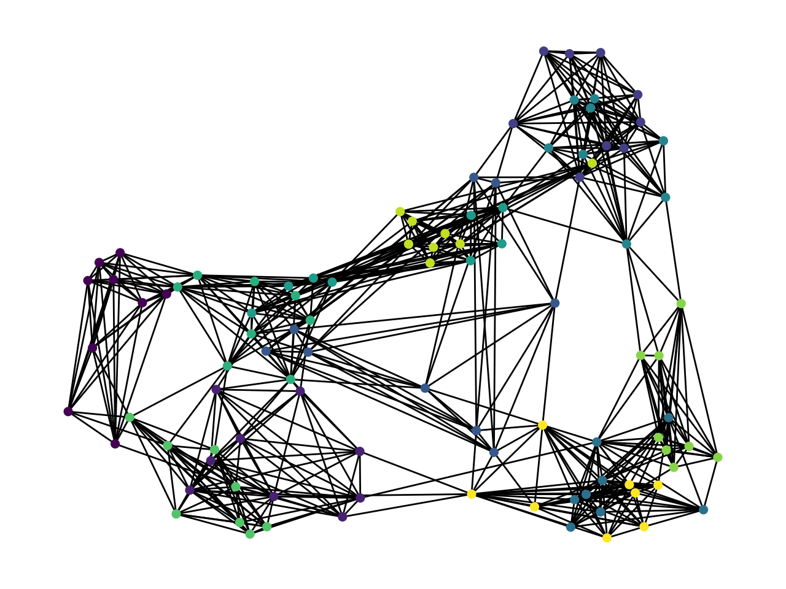
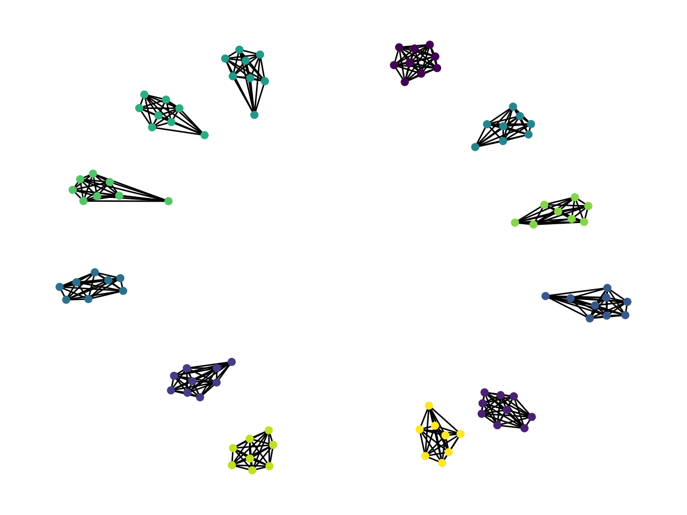

# Sparse Graph agglomerative Likelihood Clustering

[Allassan Tchangmena](https://github.com/matzolla), [Lionel Yelibi](https://github.com/lyelibi)

In this project, we propose a sparse aglomerative clustering algorithm, to cluster nodes from a graph with similar properties (base on their `weights`
and `edges`. The criterion used for clustering is a likelihood function inspired from [Giada and Marsili](https://journals.aps.org/pre/abstract/10.1103/PhysRevE.63.061101) that has been relaxed to suit graph clustering problems. Given the egde $\epsilon$ and the weight $w$ of nodes in a graph. The likelihood function can be computed using the equation:

$$ Likelihood= \frac{1}{2}\sum_{n_{s}>1}\left[ln\left(\frac{\epsilon}{w}\right) + \left(\epsilon-1\right)ln\left(\frac{\epsilon^{2}-\epsilon}{\epsilon^{2}-w}\right)\right]$$

### Results

|  Before clustering                                               |    After clustering                            |
|---------------------------------------------------------------   |  --------------------------------------------- |
|                            |                   |

### Setup

You can clone the github locally using the command
```
git clone git@github.com:matzolla/Sparse_Graph_ALC.git
```
No specific dependency is required for this code as it's primarily built from scratch. But you might need to install `numpy`.

### Getting started
You can try the [demo file]() or you might want to tweak some parameters

```python
n_samples = 100
n_features = 1000
n_clusters= 12
n_neighbors = 10
X, y = make_blobs(n_samples = n_samples, n_features = n_features,centers=n_clusters, cluster_std=1, shuffle=False)


graph = kneighbors_graph(X, n_neighbors, metric='cosine', mode='distance')
graph_mat = graph.todense()

```
You can tweak the hyper-parameters `n_samples`, `n_features`, `n_clusters` and `n_neighbors` to suit your need. The snippet above is used to generate a sparse graph using the 
`graph KNN` library available in `scikit-learn`

```python
graph_mat = graph.todense()


sol1  = graph_alc(np.array(graph_mat))

sol1.initializer()

## computing the time
start=time.time()
graphnet=sol1.Alc()
stop= time.time()

G = nx.from_numpy_matrix(graphnet)
```
The snippet above compute the different graph-clusters using the sparse ALC algorithm, (denoted here by the `graph_alc` function). We also used the `adjusted rand score` to measure the veracity of our algorithm. The [adjusted rand score](https://scikit-learn.org/stable/modules/generated/sklearn.metrics.adjusted_rand_score.html) , computes a score ranging from `0.0` (poor clustering) to `1.0` (very good clustering).
